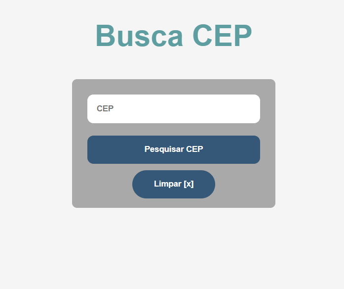

# busca Cep Api 

## Projeto Busca Rua, Bairro, Cidade e DDD da API do ViaCEP 👈 
    

## Click para ver: <a href='https://joaogabrielz.github.io/buscaCepApi/'>Deploy</a> 👈 

### Tecnologias usadas 👈 
 HTML ,  CSS ,  JAVASCRIPT ,  VsCode 

- Projeto responsivo 
